# Diagramas de Flujo de Usuario
## PromptVault - Sistema de Repositorio de Prompts

**Versión:** 1.0  
**Fecha:** 14 de Abril 2026  

---

## 1. Flujo Principal: Crear Prompt con Análisis IA

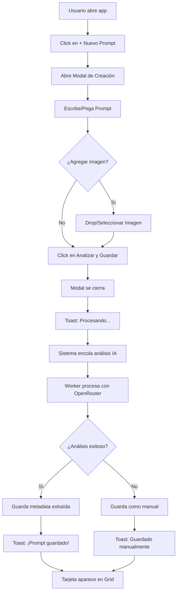

---

## 2. Flujo: Crear Prompt sin Análisis

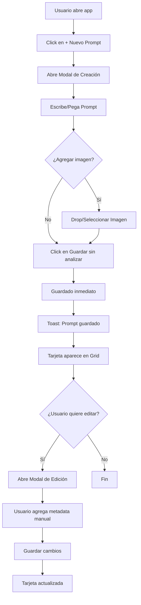

---

## 3. Flujo: Ver y Editar Prompt

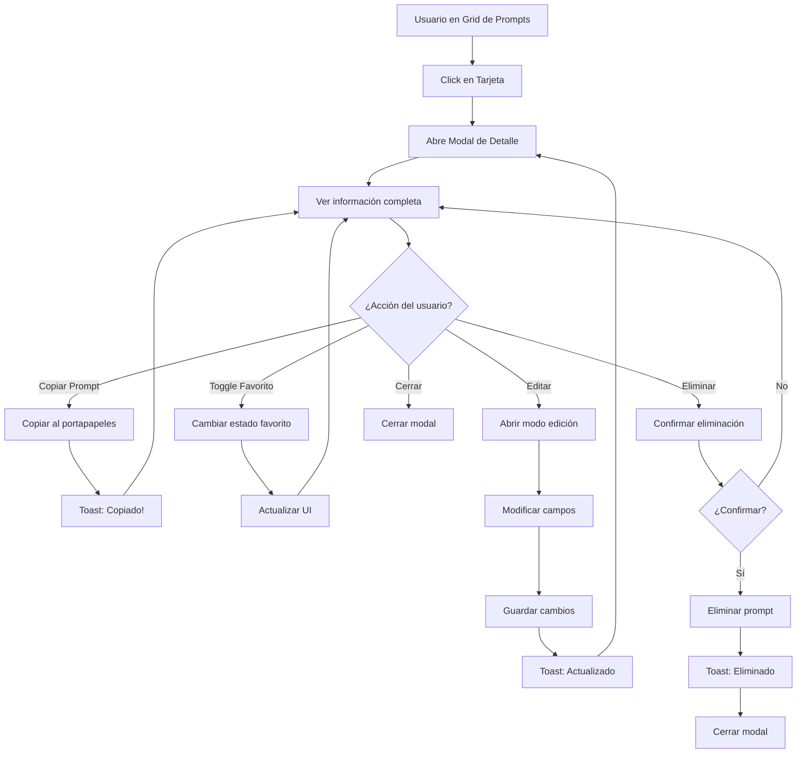

---

## 4. Flujo: Búsqueda y Filtrado

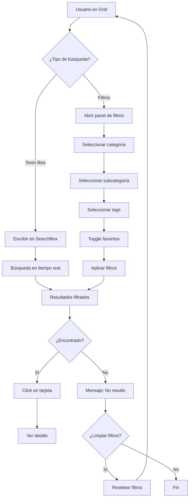

---

## 5. Flujo: Análisis IA en Background (Detallado)

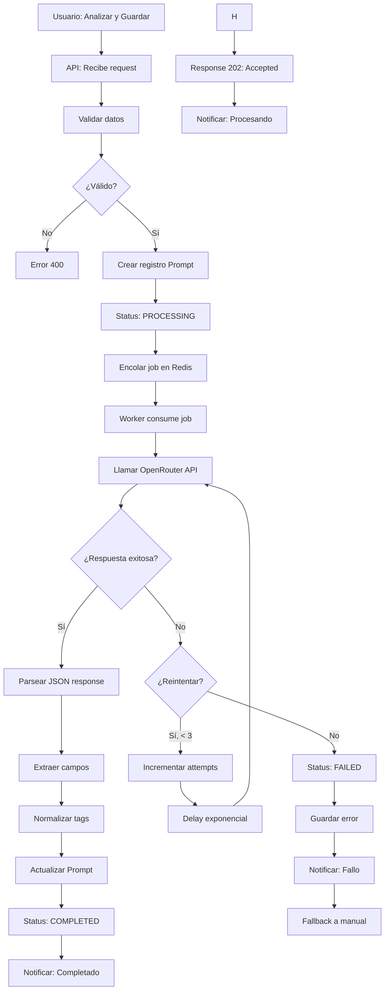

---

## 6. Flujo: Gestión de Imágenes

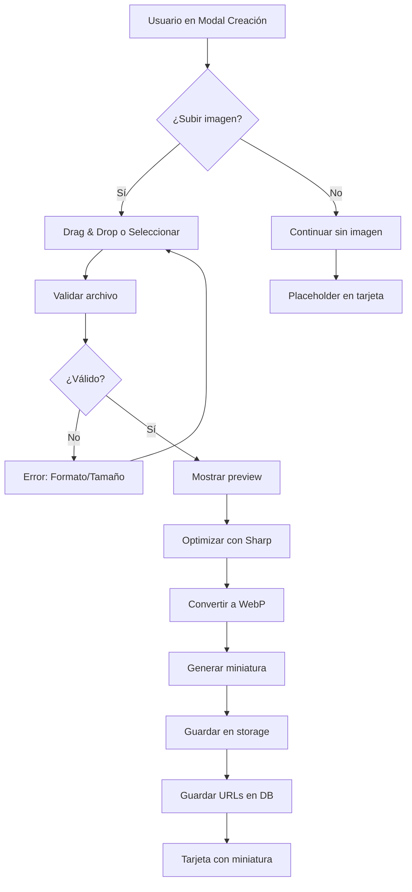

---

## 7. Flujo: Sistema de Tags Inteligente

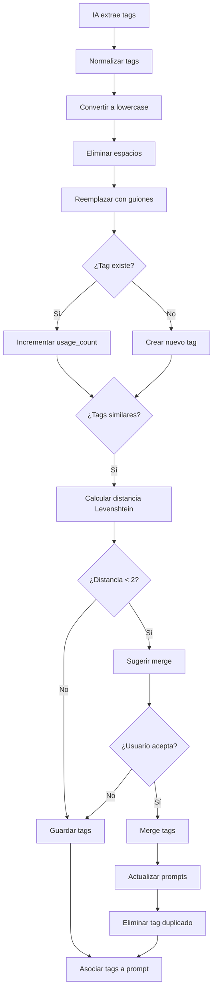

---

## 8. Flujo de Estados del Prompt

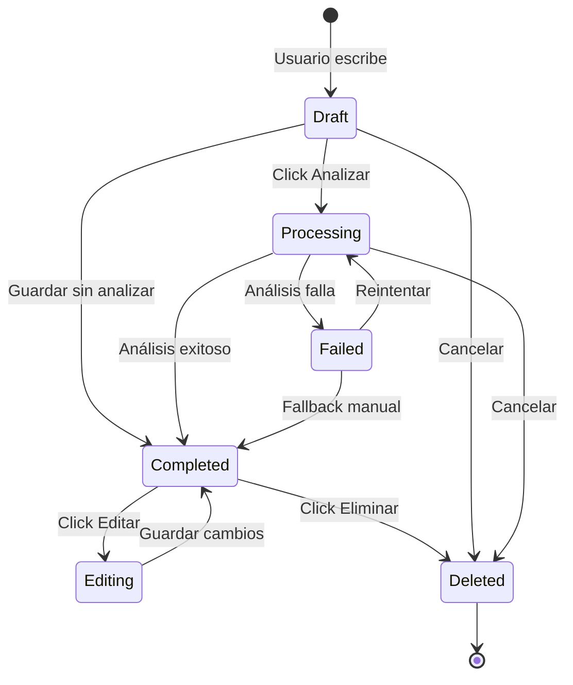

---

## 9. Flujo de Navegación Principal

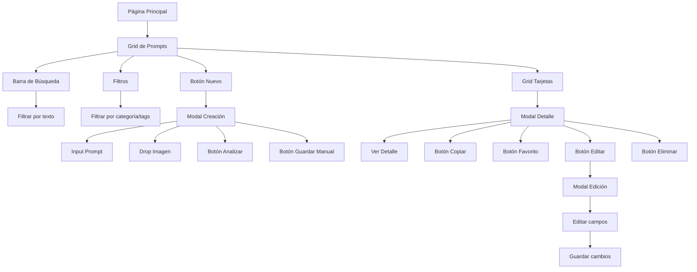

---

## 10. Flujo de Notificaciones

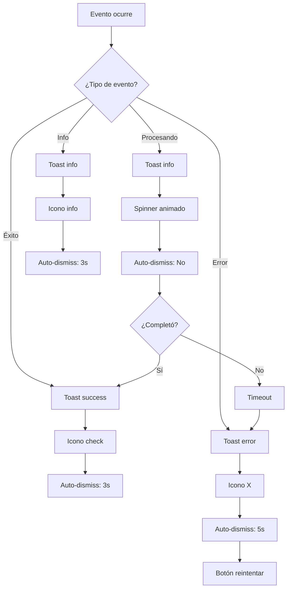

---

## 11. Flujo de Interacción Móvil (Touch)

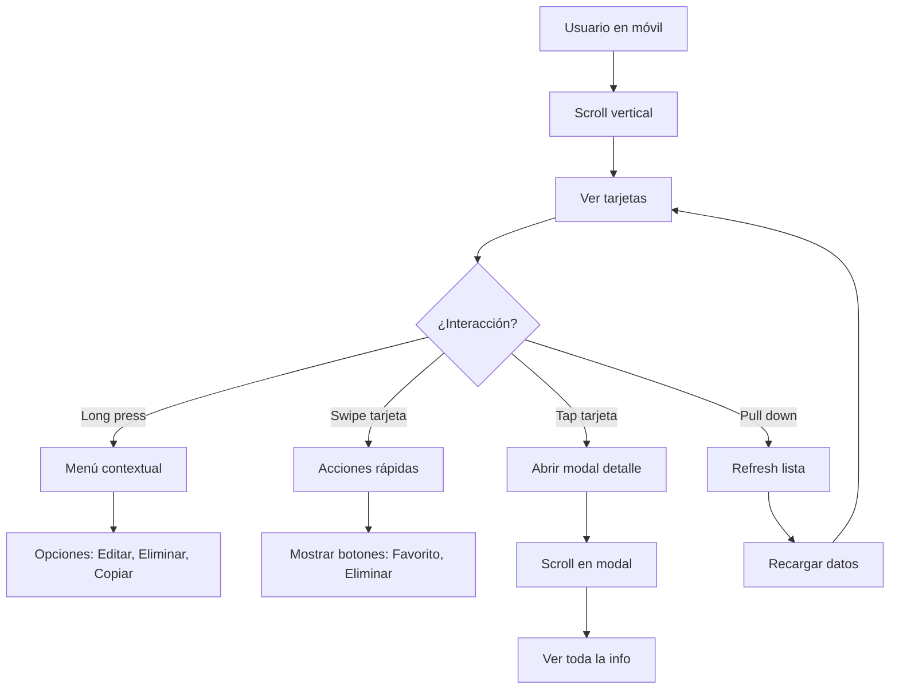

---

## 12. Flujo de Exportar/Importar (Futuro)

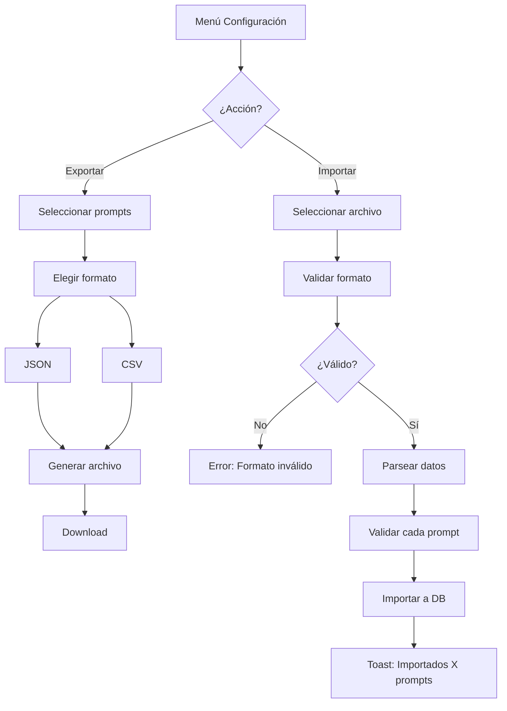

---

## Leyenda de Símbolos

| Símbolo | Significado |
|---------|-------------|
| ⭕ | Inicio/Fin |
| ▭ | Proceso/Acción |
| ◇ | Decisión |
| → | Flujo de dirección |
| ⚡ | Evento asíncrono |

---

**Notas:**
- Estos diagramas representan los flujos principales
- Algunos flujos pueden tener variaciones según edge cases
- Los flujos de error están simplificados para claridad
