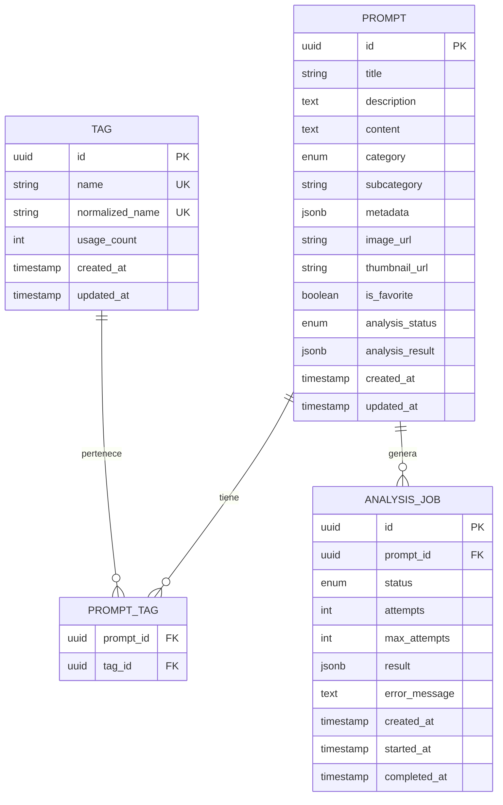

# Estructura de Base de Datos
## PromptVault - Sistema de Repositorio de Prompts

**Versión:** 1.0  
**Fecha:** 14 de Abril 2026  
**Database:** PostgreSQL 15  
**ORM:** Prisma  

---

## 1. Diagrama Entidad-Relación



---

## 2. Schema Prisma

```prisma
// prisma/schema.prisma

generator client {
  provider = "prisma-client-js"
}

datasource db {
  provider = "postgresql"
  url      = env("DATABASE_URL")
}

// ==================== ENUMS ====================

enum Category {
  IMAGEN
  VIDEO
  TEXTO
  AUDIO
}

enum AnalysisStatus {
  PENDING
  PROCESSING
  COMPLETED
  FAILED
}

enum JobStatus {
  QUEUED
  PROCESSING
  COMPLETED
  FAILED
}

// ==================== MODELS ====================

model Prompt {
  id              String         @id @default(uuid())
  title           String?        @db.VarChar(200)
  description     String?        @db.Text
  content         String         @db.Text
  category        Category?
  subcategory     String?        @db.VarChar(50)
  metadata        Json?          @db.JsonB
  imageUrl        String?        @db.VarChar(500) @map("image_url")
  thumbnailUrl    String?        @db.VarChar(500) @map("thumbnail_url")
  isFavorite      Boolean        @default(false) @map("is_favorite")
  analysisStatus  AnalysisStatus @default(PENDING) @map("analysis_status")
  analysisResult  Json?          @db.JsonB @map("analysis_result")
  createdAt       DateTime       @default(now()) @map("created_at")
  updatedAt       DateTime       @updatedAt @map("updated_at")

  // Relations
  tags            PromptTag[]
  analysisJobs    AnalysisJob[]

  // Indexes
  @@index([category])
  @@index([subcategory])
  @@index([isFavorite])
  @@index([createdAt])
  @@index([updatedAt])
  @@index([analysisStatus])
  @@map("prompts")
}

model Tag {
  id              String   @id @default(uuid())
  name            String   @unique @db.VarChar(100)
  normalizedName  String   @unique @db.VarChar(100) @map("normalized_name")
  usageCount      Int      @default(0) @map("usage_count")
  createdAt       DateTime @default(now()) @map("created_at")
  updatedAt       DateTime @updatedAt @map("updated_at")

  // Relations
  prompts         PromptTag[]

  // Indexes
  @@index([normalizedName])
  @@index([usageCount])
  @@map("tags")
}

model PromptTag {
  promptId    String   @map("prompt_id")
  tagId       String   @map("tag_id")
  
  // Relations
  prompt      Prompt   @relation(fields: [promptId], references: [id], onDelete: Cascade)
  tag         Tag      @relation(fields: [tagId], references: [id], onDelete: Cascade)

  @@id([promptId, tagId])
  @@index([tagId])
  @@map("prompt_tags")
}

model AnalysisJob {
  id              String     @id @default(uuid())
  promptId        String     @map("prompt_id")
  status          JobStatus  @default(QUEUED)
  attempts        Int        @default(0)
  maxAttempts     Int        @default(3) @map("max_attempts")
  result          Json?      @db.JsonB
  errorMessage    String?    @db.Text @map("error_message")
  createdAt       DateTime   @default(now()) @map("created_at")
  startedAt       DateTime?  @map("started_at")
  completedAt     DateTime?  @map("completed_at")

  // Relations
  prompt          Prompt     @relation(fields: [promptId], references: [id], onDelete: Cascade)

  // Indexes
  @@index([status])
  @@index([promptId])
  @@index([createdAt])
  @@map("analysis_jobs")
}
```

---

## 3. Descripción de Tablas

### 3.1 Tabla: `prompts`

| Campo | Tipo | Nullable | Default | Descripción |
|-------|------|----------|---------|-------------|
| `id` | UUID | No | uuid() | Identificador único |
| `title` | VARCHAR(200) | Sí | NULL | Título extraído por IA o manual |
| `description` | TEXT | Sí | NULL | Descripción del prompt |
| `content` | TEXT | No | - | Contenido completo del prompt |
| `category` | ENUM | Sí | NULL | Categoría principal |
| `subcategory` | VARCHAR(50) | Sí | NULL | Subcategoría específica |
| `metadata` | JSONB | Sí | NULL | Campos específicos por categoría |
| `image_url` | VARCHAR(500) | Sí | NULL | URL de imagen de ejemplo |
| `thumbnail_url` | VARCHAR(500) | Sí | NULL | URL de miniatura |
| `is_favorite` | BOOLEAN | No | false | Marcado como favorito |
| `analysis_status` | ENUM | No | PENDING | Estado del análisis IA |
| `analysis_result` | JSONB | Sí | NULL | Resultado raw del análisis |
| `created_at` | TIMESTAMP | No | now() | Fecha de creación |
| `updated_at` | TIMESTAMP | No | now() | Fecha de última actualización |

**Índices:**
- `idx_prompts_category` - Para filtrado por categoría
- `idx_prompts_subcategory` - Para filtrado por subcategoría
- `idx_prompts_is_favorite` - Para filtrar favoritos
- `idx_prompts_created_at` - Para ordenamiento
- `idx_prompts_analysis_status` - Para jobs pendientes

---

### 3.2 Tabla: `tags`

| Campo | Tipo | Nullable | Default | Descripción |
|-------|------|----------|---------|-------------|
| `id` | UUID | No | uuid() | Identificador único |
| `name` | VARCHAR(100) | No | - | Nombre original del tag |
| `normalized_name` | VARCHAR(100) | No | - | Nombre normalizado (único) |
| `usage_count` | INTEGER | No | 0 | Cuántos prompts lo usan |
| `created_at` | TIMESTAMP | No | now() | Fecha de creación |
| `updated_at` | TIMESTAMP | No | now() | Fecha de actualización |

**Índices:**
- `idx_tags_normalized_name` - Búsqueda rápida
- `idx_tags_usage_count` - Para ordenar por popularidad

**Constraints:**
- `name` debe ser único
- `normalized_name` debe ser único

---

### 3.3 Tabla: `prompt_tags` (Junction)

| Campo | Tipo | Nullable | Descripción |
|-------|------|----------|-------------|
| `prompt_id` | UUID | No | FK a prompts |
| `tag_id` | UUID | No | FK a tags |

**Constraints:**
- PK compuesta: `(prompt_id, tag_id)`
- ON DELETE CASCADE en ambas relaciones

---

### 3.4 Tabla: `analysis_jobs`

| Campo | Tipo | Nullable | Default | Descripción |
|-------|------|----------|---------|-------------|
| `id` | UUID | No | uuid() | Identificador único |
| `prompt_id` | UUID | No | - | FK al prompt |
| `status` | ENUM | No | QUEUED | Estado del job |
| `attempts` | INTEGER | No | 0 | Intentos realizados |
| `max_attempts` | INTEGER | No | 3 | Máximo de reintentos |
| `result` | JSONB | Sí | NULL | Resultado del análisis |
| `error_message` | TEXT | Sí | NULL | Mensaje de error |
| `created_at` | TIMESTAMP | No | now() | Creación del job |
| `started_at` | TIMESTAMP | Sí | NULL | Inicio del procesamiento |
| `completed_at` | TIMESTAMP | Sí | NULL | Fin del procesamiento |

**Índices:**
- `idx_analysis_jobs_status` - Para encontrar jobs pendientes
- `idx_analysis_jobs_prompt_id` - Relación inversa

---

## 4. Estructura JSON: Metadata por Categoría

### 4.1 Categoría: IMAGEN

```json
{
  "style": "fotorealista|anime|ilustración|3d|pintura|pixel-art",
  "pose": "retrato|panorámica|primer-plano|medio-cuerpo|cuerpo-completo",
  "camera": "35mm|50mm|85mm|gran-angular|telefoto|macro",
  "lighting": "natural|estudio|contraluz|hora-dorada|nocturna",
  "aspect_ratio": "1:1|16:9|9:16|4:3|3:2|21:9",
  "color_palette": "vibrante|monocromático|sepia|pastel",
  "mood": "alegre|melancólico|dramático|pacífico"
}
```

### 4.2 Categoría: VIDEO

```json
{
  "duration": "corto|medio|largo",
  "duration_seconds": 30,
  "movement": "estático|pan|zoom|tracking|dolly",
  "transitions": "suave|abrupta|fade|wipe",
  "pace": "lento|moderado|rápido",
  "style": "cinematográfico|documental|experimental"
}
```

### 4.3 Categoría: TEXTO

```json
{
  "type": "copywriting|código|análisis|creativo|resumen|traducción",
  "tone": "profesional|casual|humorístico|académico|persuasivo|empático",
  "length": "corto|medio|largo",
  "target_audience": "general|técnico|ejecutivo|niños",
  "language": "es|en|fr|de|..."
}
```

### 4.4 Categoría: AUDIO

```json
{
  "type": "voz|música|efectos",
  "style": "narrativo|conversacional|musical|ambiental",
  "genre": "rock|electrónica|clásica|jazz|pop",
  "mood": "energético|relajado|triste|alegre",
  "tempo": "lento|moderado|rápido",
  "voice_gender": "masculino|femenino|neutral",
  "voice_age": "joven|adulto|mayor"
}
```

---

## 5. Estructura JSON: Resultado de Análisis IA

```json
{
  "title": "Retrato Cyberpunk Neón",
  "description": "Prompt para generar retratos futuristas con iluminación de neón",
  "category": "IMAGEN",
  "subcategory": "retrato-digital",
  "tags": ["cyberpunk", "neon", "futurista", "retrato", "digital-art"],
  "metadata": {
    "style": "fotorealista",
    "pose": "retrato",
    "lighting": "nocturna",
    "color_palette": "vibrante"
  },
  "confidence": 0.92,
  "model_used": "gpt-4",
  "processing_time_ms": 2345
}
```

---

## 6. Queries Comunes

### 6.1 Búsqueda Full-Text

```sql
-- Búsqueda en título, descripción y contenido
SELECT * FROM prompts
WHERE to_tsvector('spanish', 
  coalesce(title, '') || ' ' || 
  coalesce(description, '') || ' ' || 
  content
) @@ plainto_tsquery('spanish', 'anime retrato')
ORDER BY created_at DESC;
```

### 6.2 Filtrado por Categoría y Tags

```sql
-- Prompts de imagen con tag 'anime'
SELECT p.* FROM prompts p
JOIN prompt_tags pt ON p.id = pt.prompt_id
JOIN tags t ON pt.tag_id = t.id
WHERE p.category = 'IMAGEN'
  AND t.normalized_name = 'anime'
ORDER BY p.created_at DESC;
```

### 6.3 Jobs Pendientes

```sql
-- Jobs en cola para procesar
SELECT * FROM analysis_jobs
WHERE status IN ('QUEUED', 'PROCESSING')
  AND attempts < max_attempts
ORDER BY created_at ASC
LIMIT 10;
```

### 6.4 Tags Populares

```sql
-- Top 20 tags más usados
SELECT * FROM tags
ORDER BY usage_count DESC
LIMIT 20;
```

---

## 7. Migraciones

### 7.1 Migración Inicial

```sql
-- Crear extensiones necesarias
CREATE EXTENSION IF NOT EXISTS "uuid-ossp";
CREATE EXTENSION IF NOT EXISTS "pg_trgm"; -- Para búsqueda fuzzy

-- Crear tipos ENUM
CREATE TYPE category AS ENUM ('IMAGEN', 'VIDEO', 'TEXTO', 'AUDIO');
CREATE TYPE analysis_status AS ENUM ('PENDING', 'PROCESSING', 'COMPLETED', 'FAILED');
CREATE TYPE job_status AS ENUM ('QUEUED', 'PROCESSING', 'COMPLETED', 'FAILED');
```

### 7.2 Migración: Full-Text Search

```sql
-- Agregar columna para búsqueda full-text
ALTER TABLE prompts ADD COLUMN search_vector tsvector;

-- Crear índice GIN
CREATE INDEX idx_prompts_search ON prompts USING GIN(search_vector);

-- Crear función para actualizar el vector
CREATE OR REPLACE FUNCTION update_search_vector()
RETURNS TRIGGER AS $$
BEGIN
  NEW.search_vector := 
    to_tsvector('spanish', 
      coalesce(NEW.title, '') || ' ' || 
      coalesce(NEW.description, '') || ' ' || 
      NEW.content
    );
  RETURN NEW;
END;
$$ LANGUAGE plpgsql;

-- Crear trigger
CREATE TRIGGER trigger_update_search_vector
BEFORE INSERT OR UPDATE ON prompts
FOR EACH ROW EXECUTE FUNCTION update_search_vector();
```

---

## 8. Backup y Restore

### 8.1 Backup

```bash
# Backup completo
pg_dump -h localhost -U user -d promptvault > backup_$(date +%Y%m%d).sql

# Backup solo datos
pg_dump -h localhost -U user -d promptvault --data-only > backup_data.sql

# Backup solo schema
pg_dump -h localhost -U user -d promptvault --schema-only > backup_schema.sql
```

### 8.2 Restore

```bash
# Restaurar backup
psql -h localhost -U user -d promptvault < backup_20260414.sql
```

---

## 9. Monitoreo de Base de Datos

### 9.1 Queries de Monitoreo

```sql
-- Tamaño de tablas
SELECT 
  schemaname,
  tablename,
  pg_size_pretty(pg_total_relation_size(schemaname||'.'||tablename)) as size
FROM pg_tables
WHERE schemaname = 'public'
ORDER BY pg_total_relation_size(schemaname||'.'||tablename) DESC;

-- Conexiones activas
SELECT count(*) FROM pg_stat_activity;

-- Queries lentas (requiere pg_stat_statements)
SELECT query, mean_exec_time, calls
FROM pg_stat_statements
ORDER BY mean_exec_time DESC
LIMIT 10;
```

---

## 10. Consideraciones de Escalabilidad

### 10.1 Cuándo Escalar

| Métrica | Umbral | Acción |
|---------|--------|--------|
| Tamaño DB | > 10GB | Revisar índices, archivar datos |
| Prompts | > 100K | Considerar particionamiento |
| Tags | > 10K | Optimizar índices |
| Conexiones | > 80% | Aumentar connection pool |

### 10.2 Particionamiento (Futuro)

```sql
-- Particionar prompts por fecha
CREATE TABLE prompts_partitioned (
  LIKE prompts INCLUDING ALL
) PARTITION BY RANGE (created_at);

-- Crear particiones mensuales
CREATE TABLE prompts_2026_04 PARTITION OF prompts_partitioned
  FOR VALUES FROM ('2026-04-01') TO ('2026-05-01');
```

---

**Notas:**
- El schema está optimizado para Railway PostgreSQL
- Los índices deben crearse después de cargas masivas iniciales
- Monitorear el tamaño de JSONB para evitar bloat
